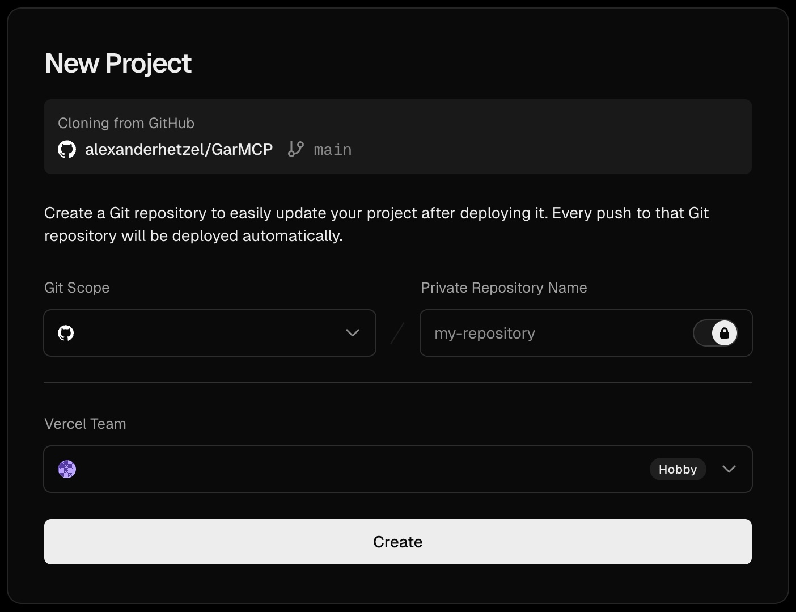
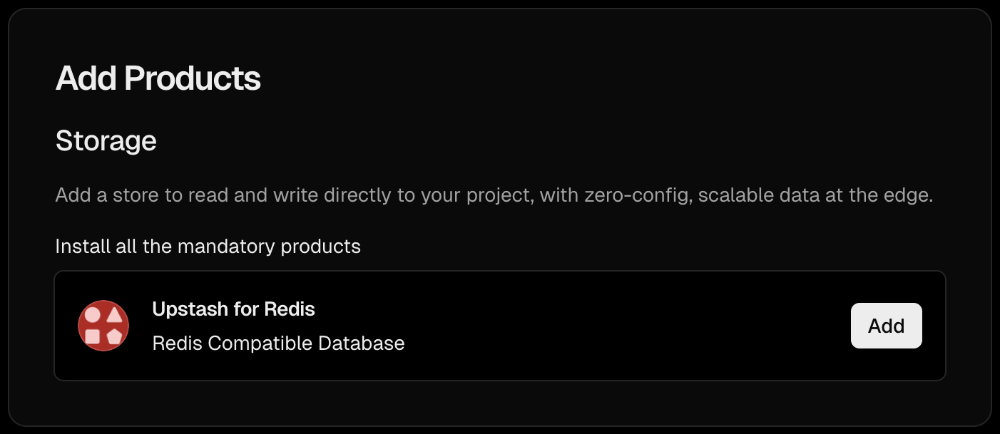
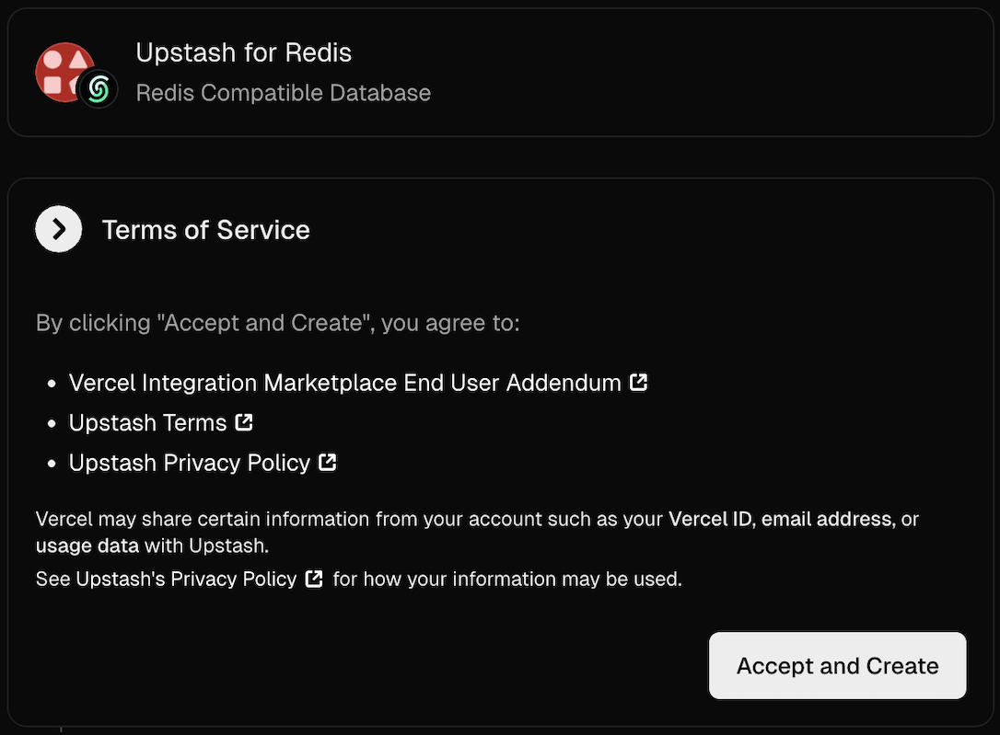
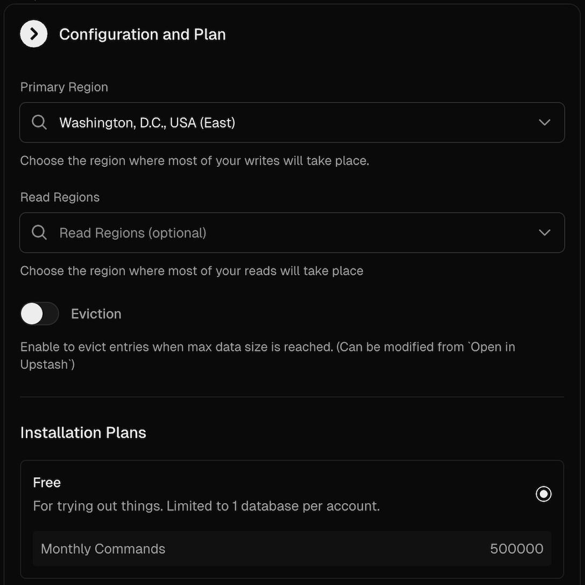
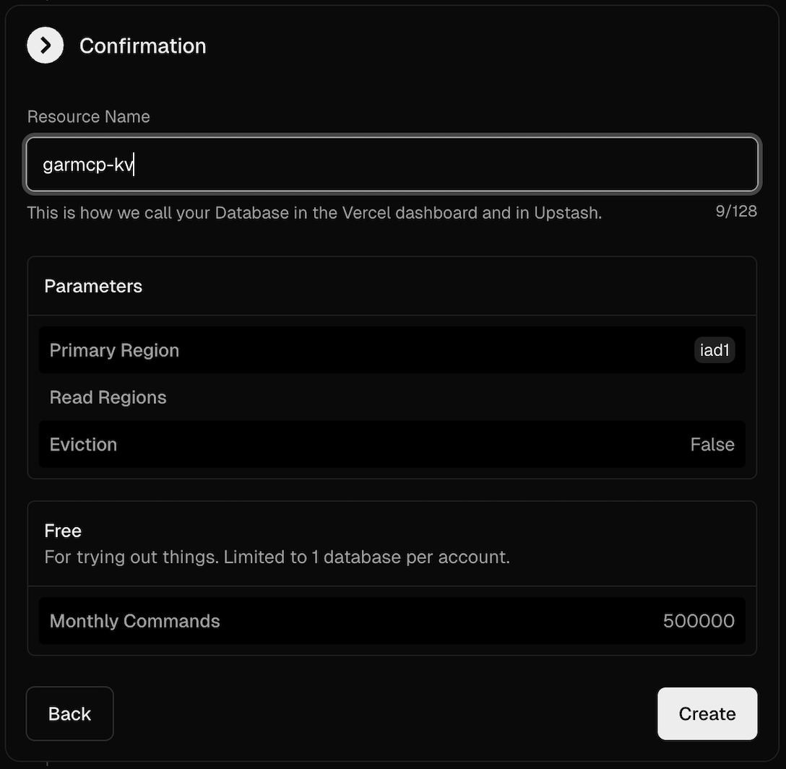
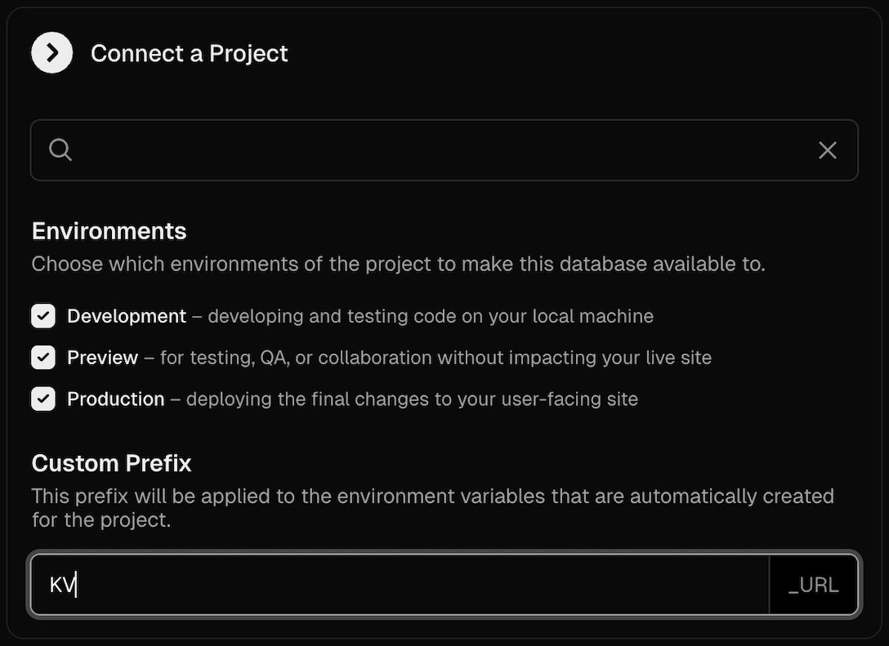
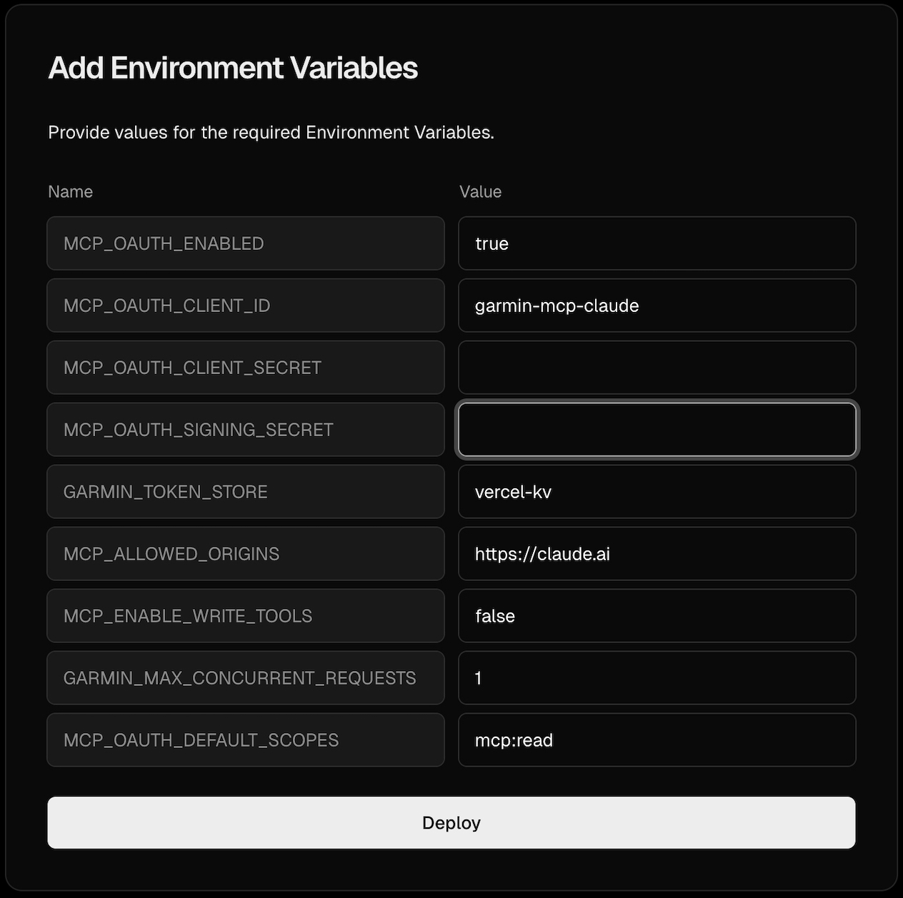
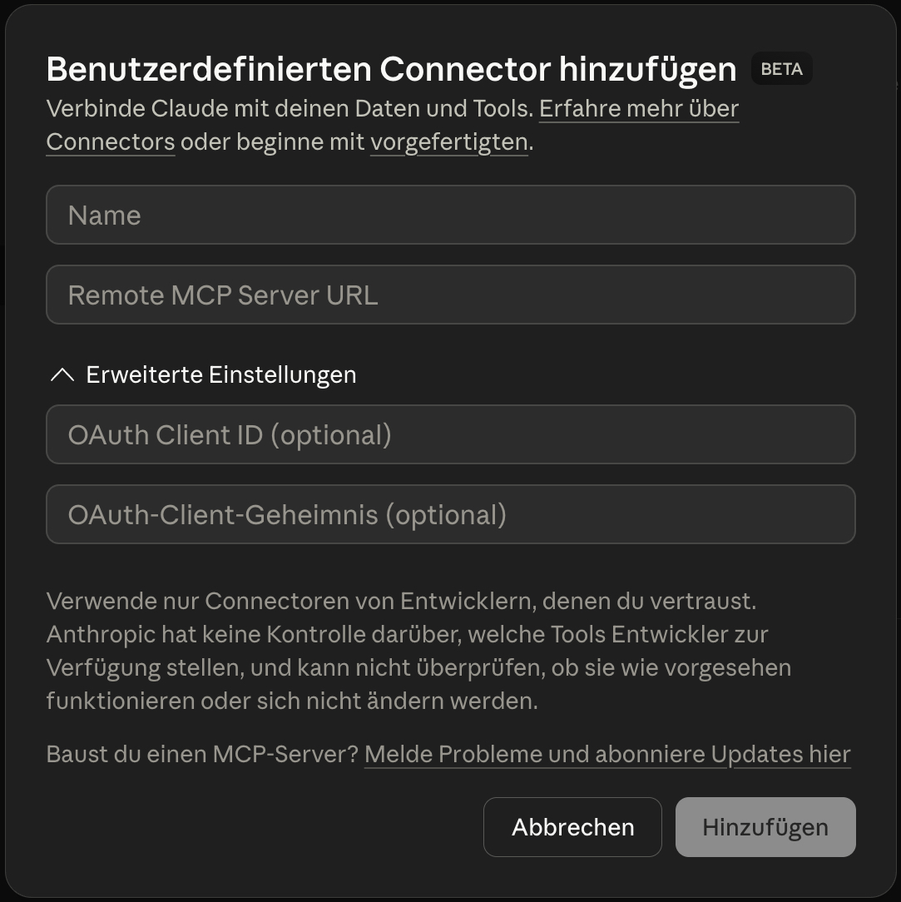

# GarMCP

<picture>
  <source media="(prefers-color-scheme: dark)" srcset="./public/branding/GarMCP_logo_white.svg" />
  <source media="(prefers-color-scheme: light)" srcset="./public/branding/GarMCP_logo.svg" />
  
</picture>

<a href="https://vercel.com/new/clone?repository-url=https%3A%2F%2Fgithub.com%2Falexanderhetzel%2FGarMCP.git&env=MCP_OAUTH_ENABLED,MCP_OAUTH_CLIENT_ID,MCP_OAUTH_CLIENT_SECRET,MCP_OAUTH_SIGNING_SECRET,GARMIN_TOKEN_STORE,MCP_ALLOWED_ORIGINS,MCP_ENABLE_WRITE_TOOLS,GARMIN_MAX_CONCURRENT_REQUESTS,MCP_OAUTH_DEFAULT_SCOPES&envDefaults=%7B%22MCP_OAUTH_ENABLED%22%3A%22true%22%2C%22MCP_OAUTH_CLIENT_ID%22%3A%22garmin-mcp-claude%22%2C%22GARMIN_TOKEN_STORE%22%3A%22vercel-kv%22%2C%22MCP_ALLOWED_ORIGINS%22%3A%22https%3A%2F%2Fclaude.ai%22%2C%22MCP_ENABLE_WRITE_TOOLS%22%3A%22false%22%2C%22GARMIN_MAX_CONCURRENT_REQUESTS%22%3A%221%22%2C%22MCP_OAUTH_DEFAULT_SCOPES%22%3A%22mcp%3Aread%22%7D&project-name=garmcp&products=%5B%7B%22type%22%3A%22integration%22%2C%22integrationSlug%22%3A%22upstash%22%2C%22productSlug%22%3A%22upstash-kv%22%2C%22protocol%22%3A%22storage%22%7D%5D"></a>

## What Is GarMCP?

GarMCP is a Model Context Protocol (MCP) server that lets LLM clients (for example Claude) securely query Garmin Connect data through tools.

It is built for:

- athletes who want Garmin insights directly inside LLM chat
- developers who want a self-hosted Garmin MCP backend
- teams that want a cloud endpoint (`/mcp`) instead of local-only stdio

What it provides:

- 90+ Garmin read tools across activity, sleep, recovery, profile, trends, and training data
- Streamable HTTP MCP endpoint for Claude Web/Mobile custom connectors
- local stdio mode for desktop/dev workflows
- OAuth-protected connector flow and per-user Garmin token storage

Project scope:

- v1 is focused on single-user cloud deployments
- read-only by default (`MCP_ENABLE_WRITE_TOOLS=false`)
- optimized for Vercel + Upstash Redis REST token storage

Notes:

- This project is community-built and not affiliated with Garmin.
- This project in particular is based on [`python-garminconnect`](https://github.com/cyberjunky/python-garminconnect) by [cyberjunky](https://github.com/cyberjunky) and [`garmin-connect-mcp`](https://github.com/Nicolasvegam/garmin-connect-mcp) by [Nicolasvegam](https://github.com/Nicolasvegam).

## One-Click Deploy Walkthrough (Vercel)

### Cost note (private use)

For personal/private usage, this setup can run at **$0** on:

- **Vercel Hobby** (free plan)
- **Upstash Redis Free** (includes free usage limits)

As long as you stay within the free quotas, no charges are expected.
If you exceed limits or switch to paid tiers, billing may apply.

This section shows the full path from **Deploy on Vercel** to a working **Claude custom connector**.

### 1. Create a new Vercel project from the Deploy button

<a href="https://vercel.com/new/clone?repository-url=https%3A%2F%2Fgithub.com%2Falexanderhetzel%2FGarMCP.git&env=MCP_OAUTH_ENABLED,MCP_OAUTH_CLIENT_ID,MCP_OAUTH_CLIENT_SECRET,MCP_OAUTH_SIGNING_SECRET,GARMIN_TOKEN_STORE,MCP_ALLOWED_ORIGINS,MCP_ENABLE_WRITE_TOOLS,GARMIN_MAX_CONCURRENT_REQUESTS,MCP_OAUTH_DEFAULT_SCOPES&envDefaults=%7B%22MCP_OAUTH_ENABLED%22%3A%22true%22%2C%22MCP_OAUTH_CLIENT_ID%22%3A%22garmin-mcp-claude%22%2C%22GARMIN_TOKEN_STORE%22%3A%22vercel-kv%22%2C%22MCP_ALLOWED_ORIGINS%22%3A%22https%3A%2F%2Fclaude.ai%22%2C%22MCP_ENABLE_WRITE_TOOLS%22%3A%22false%22%2C%22GARMIN_MAX_CONCURRENT_REQUESTS%22%3A%221%22%2C%22MCP_OAUTH_DEFAULT_SCOPES%22%3A%22mcp%3Aread%22%7D&project-name=garmcp&products=%5B%7B%22type%22%3A%22integration%22%2C%22integrationSlug%22%3A%22upstash%22%2C%22productSlug%22%3A%22upstash-kv%22%2C%22protocol%22%3A%22storage%22%7D%5D"></a>

Choose your Git scope, give the project a name, choose your Vercel team and click **Create**.



### 2. Add required product: Upstash for Redis

In **Add Products**, click **Add** for **Upstash for Redis**.



### 3. Accept Upstash terms

In the integration modal, accept terms and continue.



### 4. Configure region and plan

Choose your primary region and select a plan (for private use: typically **Free**).



### 5. Set a resource name and create the database

Pick a database name (for example `garmcp-kv`) and click **Create**.



### 6. Connect Upstash to project environments

Select your project, **Development**, **Preview**, and **Production**, then strictly set custom prefix to `KV`.
This auto-creates env vars like `KV_REST_API_URL` and `KV_REST_API_TOKEN`.



### 7. Fill required environment variables and deploy

Fill all required GarMCP env vars and click **Deploy**.
Important values:

- `MCP_OAUTH_CLIENT_SECRET`: long random secret (32+ chars)
- `MCP_OAUTH_SIGNING_SECRET`: different long random secret (48+ chars)
- `GARMIN_TOKEN_STORE=vercel-kv`
- `MCP_ALLOWED_ORIGINS=https://claude.ai`
- `MCP_ENABLE_WRITE_TOOLS=false`
- `GARMIN_MAX_CONCURRENT_REQUESTS=1`



### 8. Add the connector in Claude

In Claude custom connectors:

- Name: A custom name at will for your MCP in Claude
- URL: `https://<your-deployment>/mcp`
- OAuth Client ID: your `MCP_OAUTH_CLIENT_ID`
- OAuth Client Secret: your `MCP_OAUTH_CLIENT_SECRET`



### 9. Authorize and start using GarMCP tools

After successful OAuth authorization, Garmin tools are available in Claude.

### Deployment notes

- If deploy logs show `invalid Node.js Version: "24.x"`, set your Vercel project runtime to **Node 22.x** and redeploy.
- First Garmin login can occasionally hit temporary Garmin `429` limits; wait a bit and retry.

GarMCP server with two modes:

- local stdio mode (`npm run start:stdio`)
- remote Streamable HTTP mode (`npm start`) for Claude Web/Mobile custom connectors

## Runtime Modes

- `npm run start:stdio`: local MCP over stdio (manual/debug run)
- `npm start` / `npm run start:http`: HTTP MCP server
- Vercel serverless handlers in `api/*` expose OAuth + MCP endpoints

## Local Usage (stdio)

Required:

- `GARMIN_EMAIL`
- `GARMIN_PASSWORD`

### Claude Desktop / MCP client-managed process (recommended)

For Claude Desktop (and most MCP clients), you usually do **not** run
`npm run start:stdio` manually. The client starts the stdio process itself
from its MCP config.

Build once (and rebuild after code changes):

```bash
npm install
npm run build
```

Then configure your MCP client with:

- command: `node`
- args: `["/absolute/path/to/garmin-connect-mcp/build/index.js"]`
- env: `GARMIN_EMAIL`, `GARMIN_PASSWORD` (optional `GARMIN_TOKEN_DIR`)

### Manual stdio run (debug only)

Use manual start only for debugging or direct CLI testing:

```bash
GARMIN_EMAIL=you@email.com GARMIN_PASSWORD=yourpass npm run start:stdio
```

## Cloud Quickstart (Vercel + Claude OAuth)

### 1) Configure environment variables in Vercel

Required:

- `MCP_OAUTH_ENABLED=true`
- `MCP_OAUTH_CLIENT_ID=<your-client-id>`
- `MCP_OAUTH_CLIENT_SECRET=<your-client-secret>`
- `MCP_OAUTH_SIGNING_SECRET=<long-random-secret>`
- `MCP_ALLOWED_ORIGINS=https://claude.ai`
- `GARMIN_TOKEN_STORE=vercel-kv`
- `KV_REST_API_URL=<from Upstash/Vercel integration>`
- `KV_REST_API_TOKEN=<from Upstash/Vercel integration>`

Recommended:

- `MCP_ENABLE_WRITE_TOOLS=false`
- `GARMIN_MAX_CONCURRENT_REQUESTS=1`

Optional:

- `GARMIN_TOKEN_DIR=/tmp/garmin-mcp` (namespace base for token keys)
- `GARMIN_EMAIL` and `GARMIN_PASSWORD` (fallback when token storage is unavailable)
- `MCP_API_KEY` and `MCP_OAUTH_ALLOW_API_KEY_FALLBACK=true` (Inspector/API-key testing)
- `MCP_OAUTH_REDIRECT_URIS` (restrict OAuth redirect targets)

### 2) Deploy

```bash
npm install
npm run check
vercel --prod
```

### 3) Add custom connector in Claude

- URL: `https://<your-domain>/mcp`
- OAuth Client ID: same value as `MCP_OAUTH_CLIENT_ID`
- OAuth Client Secret: same value as `MCP_OAUTH_CLIENT_SECRET`

Connector flow:

1. Claude hits `/mcp`
2. OAuth starts at `/authorize`
3. User enters Garmin credentials
4. Server stores Garmin tokens per OAuth subject
5. Tool calls use stored Garmin tokens

## Endpoints

- `GET /health`
- `POST|GET|DELETE /mcp`
- `GET|POST /authorize`
- `POST /token`
- `GET /.well-known/oauth-authorization-server`
- `GET /.well-known/oauth-protected-resource/mcp`

## Troubleshooting

- `Garmin re-authorization required: no stored Garmin tokens...`
  - Cause: token storage not reachable or empty in current runtime.
  - Fix: verify `GARMIN_TOKEN_STORE`, `KV_REST_API_URL`, `KV_REST_API_TOKEN`; reconnect OAuth once.

- `Request failed with status code 429`
  - Cause: Garmin rate limit.
  - Fix: wait and retry, keep request volume low, use `GARMIN_MAX_CONCURRENT_REQUESTS=1`.

- `Session not found`
  - Cause: stale/expired MCP session id.
  - Fix: reconnect client (Inspector/Claude), re-run call.

- `Vercel Runtime Timeout Error: Task timed out after 300 seconds`
  - Usually a long-lived/idle stream request in serverless runtime.
  - If tool calls still succeed in Claude, this is often non-fatal reconnect noise.

- `Unauthorized` on `/mcp`
  - With OAuth enabled, client must send valid OAuth bearer token.
  - For Inspector testing, use API-key fallback only if explicitly configured.

## Development

```bash
# clone your fork (or open this repo locally)
# git clone <your-fork-url>
# cd <repo-folder>
npm install
npm run typecheck
npm run build
```

## License

MIT
